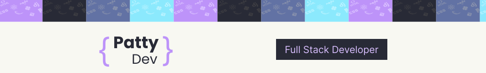

  

# 👋 Hello, I'm Patricia!

I'm a full stack developer passionate about technology and software development. I'm always looking to learn new technologies and improve my skills.

## 🛠 Technologies and Tools
### Programming Languages:

  
  

### Frontend:

  
  
  

### Backend:

  
  
  
  

### Database:

  

### Others:

  
  

## 📈 GitHub Stats

  
  

## 📫 How to find me

  
  

Thanks for visit my profile! 😊

